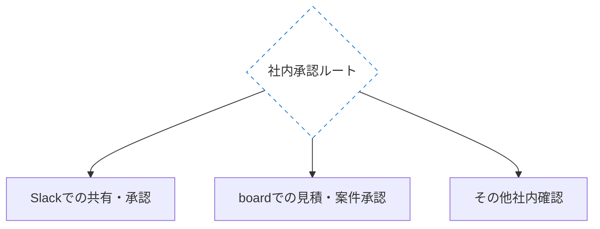

# コントリビュートガイド

このリポジトリへの貢献を歓迎します。

---

## ファイル形式（YAMLフロントマター）

すべてのコンテンツファイルはファイル先頭に **YAMLフロントマター** を記述してください。
`templates/` にファイルタイプ別のテンプレートがあります。

### file_type 一覧

| file_type | 対象ファイル | 必須プロパティ |
|---|---|---|
| `"standard"` | `workflows/_standardized-20/*/flow-standard.md` | psid_service_category, psid_lifecycle, flow_type, spec_ref, spec_law |
| `"canonical"` | `workflows/administrative-commons/*/flow-canonical.md` | psid_service_category, psid_lifecycle, flow_type, spec_ref |
| `"gap-notes"` | `*/gap-notes.md` | flow_type, related_workflow |
| `"journey"` | `journeys/*.md` | psid_lifecycle, psid_services, psid_ref |
| `"backoffice-journey"` | `journeys/backoffice/*.md` | backoffice_cycle, related_workflows, psid_ref |
| `"incident"` | `incident-catalog/INC-*.md` | id, title, severity, frequency, fix_cost |
| `"stakeholder-profile"` | `stakeholders/*.md` | stakeholder_type, organization_name, legal_basis |
| `"concept"` | `concepts/*.md` | concept_id, concept_name, divergence_scope, related_workflows, ai_caution |
| `"overview"` | `workflows/_standardized-20/*/overview.md` | （必須プロパティなし。file_type のみ） |

### 記述例（flow-standard.md）

```yaml
---
psid_service_category: "C1"
psid_lifecycle: "L5"
psid_lifecycle_also: ["L4", "L8"]
flow_type: "standard"
spec_ref: "住民記録システム標準仕様書【第5.0版】総務省 2024-03-28"
spec_law: "住民基本台帳法 第22〜24条"

depends_on:
  - target: "concepts/household.md"
    type: "definition_dependency"
    note: "世帯の構成・世帯主の定義が転入処理の基礎"

triggers:
  - target: "workflows/_standardized-20/kokumin-kenko-hoken/"
    event: "国保加入資格者（社保未加入者）が転入した場合"
    note: "14日以内に国保加入届が必要"

creates_risks:
  - target: "incident-catalog/INC-001-dv-cross-department.md"
    condition: "DV支援措置対象者の住所情報が他課に漏洩した場合"

concept_dependencies:
  - target: "concepts/household.md"
    note: "世帯の構成・世帯分離・世帯主の認定"

review_status: "drafted"
applicability_scope: "national-common"
---
```

### Mermaid図のアクター表現

業務フロー図（flow-standard.md / flow-canonical.md）では `subgraph` を使って担当者ブロックを明示してください。
GitHub・Obsidianどちらでもレンダリングされます。

```mermaid
flowchart TD
    subgraph 住民・申請者
        A["申請書提出"]
    end
    subgraph 窓口担当
        B["受付・確認"]
    end
    A --> B
```

### 分岐ノードの AND / OR 表現

`{条件}` 型の分岐先が複数ノードに枝分かれし、後段で再合流する図（fork-join）は、
図の形だけでは「全部が必須の並列処理（AND）」なのか「どれか1つだけを使う排他的な代替パス（OR）」なのか区別できません
（例: 検収・請求の並列処理 N1・N2 は両方必須の AND、社内承認ルート G1/G2/G3 はどれか1つだけを使う OR）。

- **AND（既定）**: 分岐元ノードは `:::cond` のまま。何もマークしなければ全枝が個別に必須として扱われる。
- **OR（排他的な代替パス）**: 分岐元ノードに `:::condOr` を付ける。本アプリの nodeCoverage はこのマークを見て、
  分岐先のいずれか1つが実務で確認できればグループ全体を確認済み扱いにする
  （マークし忘れると、実際には使われない枝を永遠に「未確認」として聞き続けてしまう）。



### 依存関係フロントマター

`flow-standard.md` / `flow-canonical.md` / `journeys/*.md` には、業務間の依存・連鎖・リスクを記述する任意プロパティを追加できます。
把握済みのものから段階的に記述してください。すべてのプロパティが必須ではありません。

| プロパティ | 意味 | 対象ファイル |
|---|---|---|
| `depends_on` | この業務が前提とするデータ・定義・権限 | standard, canonical, journey |
| `triggers` | この業務の処理結果が後続業務を呼び出す条件 | standard, canonical, journey |
| `creates_risks` | このフローの欠陥・漏れがインシデントに転化する条件 | standard, canonical, journey |
| `concept_dependencies` | この業務で登場する概念競合（`concepts/`参照） | standard, canonical |
| `review_status` | `drafted` / `reviewed` / `verified` | すべて |
| `applicability_scope` | `national-common` / `requires-local-check` | すべて |

**`depends_on` の type 値**:

| type | 意味 |
|---|---|
| `data_dependency` | 前工程のデータ出力に依存する（例：転入届→国保加入処理） |
| `timing_dependency` | 特定の時期・期限に依存する（例：年度末処理→翌年度予算） |
| `definition_dependency` | 概念・用語の定義に依存する（例：「世帯」の定義） |
| `authority_dependency` | 他機関・他課の権限行使に依存する（例：医師の意見書） |
| `notification_dependency` | 他課・他機関からの通知・情報提供に依存する（例：DV情報の共有） |

**記述例（jyumin-ido/flow-standard.md）**:

```yaml
depends_on:
  - target: "concepts/household.md"
    type: "definition_dependency"
    note: "世帯の構成・世帯主の定義が転入処理の基礎"

triggers:
  - target: "workflows/_standardized-20/kokumin-kenko-hoken/"
    event: "国保加入資格者（社保未加入者）が転入した場合"
    note: "14日以内に国保加入届が必要"

creates_risks:
  - target: "incident-catalog/INC-001-dv-cross-department.md"
    condition: "DV支援措置対象者の住所情報が他課に漏洩した場合"

concept_dependencies:
  - target: "concepts/household.md"
    note: "世帯の構成・世帯分離・世帯主の認定"

review_status: "drafted"
applicability_scope: "national-common"
```

---

## 貢献の種類

### A. gap-notes・incident-catalog への追記（最も歓迎）

`gap-notes.md` や `incident-catalog/` への追記は **Pull Request** で受け付けます。

**記述の原則**:
- 「全国共通の知識」と「自治体固有の運用」を明確に区別する
- 法令・通知の根拠を明示する
- 「なぜそうするのか」の理由を書く

### B. 新しい業務フローの追加

#### 標準化対象業務（`_standardized-20/`）

デジタル庁・各省の標準仕様書に基づく業務フローを追加する場合は `templates/workflow-template.md` を使用してください。

```
workflows/_standardized-20/[業務フォルダ名]/
├── flow-standard.md   # 標準仕様書に基づく「あるべきフロー」
└── gap-notes.md       # 仕様書と現実の差分
```

**判断基準**: デジタル庁の標準化対象20業務に含まれる、または省庁が公式な標準仕様書を公開している業務。

#### 汎用行政業務（`administrative-commons/`）

全国共通の典型的な実務慣行に基づくフローを追加する場合は `templates/flow-canonical-template.md` を使用してください。

```
workflows/administrative-commons/[業務フォルダ名]/
├── flow-canonical.md  # 全国的な典型フロー（「おそらくこうやっている」）
└── gap-notes.md       # 典型例と個別運用の差分
```

**判断基準**: 全国どの自治体でも行われているが、標準仕様書がない業務（照会回答・発注・会議運営・監査・補助金管理等）。
⚠️ 標準仕様書なしの典型例であることをフロントマターの `flow_type: "canonical"` と `spec_ref: "なし（全国自治体の一般的な実務）"` で明示すること。

### C. 新しいジャーニーの追加

#### 住民ジャーニー（`journeys/`）

`templates/journey-template.md` を参考に追加してください。
PSIDのL-コード（L1〜L12）に対応します。

#### バックオフィスジャーニー（`journeys/backoffice/`）

`templates/backoffice-journey-template.md` を参考に追加してください。
O-コード（O1〜O4）で分類します。

| O-コード | サイクル | 状態 |
|---|---|---|
| O1 | 年度サイクル（予算編成〜決算） | 整備済み |
| O2 | 議会対応サイクル | 整備済み |
| O3 | 人事異動サイクル | 整備済み |
| O4 | 監査・検査対応サイクル | 整備済み |

### D. インシデントの追加・更新

`templates/incident-template.md` に従って記述し、
`incident-catalog/README.md` の一覧と severity 別集計に追記してください。

**severity の基準**:
- `critical`: 住民の生命・安全に関わる / 自治体の法令違反に直結する
- `high`: 住民の権利侵害・訴訟リスク / 重大な経済的損失
- `medium`: 業務品質の低下 / 軽微な損失・クレームリスク

### E. ステークホルダープロファイルの追加

`templates/stakeholder-profile-template.md` を参考に `stakeholders/` に追加してください。

**記載するもの（構造知識）**: 組織の法的根拠・役割分担・制度的ギャップ
**記載しないもの（関係知識）**: 担当者名・連絡先・交渉経緯・関係の良悪
→ 関係知識はCode for Japan内部KB（Notion）に記録する。詳細は `CONTRIBUTING_INTERNAL.md` 参照。

### F. 概念競合ファイルの追加（`concepts/`）

行政制度において「同じ言葉が制度ごとに異なる定義を持つ」概念を `concepts/` に追加してください。

**追加の判断基準**（3つすべてを満たすこと）:
1. 複数の制度で同じ言葉が異なる定義で使われている
2. その差異が住民への誤案内・職員間の認識齟齬・AIの誤推論に直結する
3. 複数の業務フローにまたがって影響している

**記述例**:

```yaml
---
file_type: "concept"
concept_id: "CONCEPT-HOUSEHOLD"
concept_name: "世帯"
divergence_scope:
  - "住基（住民基本台帳）"
  - "国民健康保険"
  - "地方税"
  - "生活保護"
related_workflows:
  - "workflows/_standardized-20/jyumin-ido/"
  - "workflows/_standardized-20/kokumin-kenko-hoken/"
related_incidents:
  - "incident-catalog/INC-001-dv-cross-department.md"
ai_caution: true
review_status: "drafted"
---
```

`ai_caution: true` は、AIが「同じ制度の定義である」と誤って推論してしまう危険性が高い概念に付けてください。

**現在の概念一覧**: `concepts/README.md` 参照。新しい概念を追加したら `concepts/README.md` のファイル一覧も更新してください。

### G. 業務概要（`overview.md`）の追加

`flow-standard.md` の frontmatter（`spec_law` 等）は根拠条文の一行引用に留まるが、
制度の趣旨・沿革・年間サイクル・全国的によくある論点といった「その業務を知らない人向けの
解説」は書ける場所がなかった。`workflows/_standardized-20/<業務フォルダ>/overview.md` に
`templates/overview-template.md` を参考に追加してください（全業務必須ではない任意ドキュメント）。

**記載するもの**: 制度の概要（沿革・立法趣旨）、課税・給付等の基本構造、年間の定型サイクル、
全国的によくある構造的な論点
**記載しないもの**: 自治体固有の運用・担当者名等（`local/` を使う）、個別のインシデント詳細
（`incident-catalog/` を使う）、標準フローの手順そのもの（`flow-standard.md` を使う）

見出しは他のドキュメント種別と同様、必ず `## `（H2）を使うこと。用途上、インタビューAIが
「業務名を教えてください」のようなゼロベースの質問をせず、この内容を仮説として提示した上で
確認する形に変換して使う（`lib/kb/hypothesis.ts` の `loadTaskHypothesis` 参照）。

### H. 誤りの報告

**Issue** で報告してください。以下を記載してください。
- 誤りのある箇所（ファイル名・セクション名）
- 正しい内容
- 根拠（法令・通知・標準仕様書等）

---

## Pull Request の手順

1. このリポジトリを **Fork**
2. 作業ブランチを作成（例: `add/gap-notes-jido-teate`、`update/incident-INC-010`、`add/concept-domicile`）
3. `templates/` の該当テンプレートをコピーして内容を記述
4. YAMLフロントマターの必須プロパティがすべて埋まっているか確認
5. `depends_on` / `triggers` / `creates_risks` の記述が可能な場合は追記（任意）
6. Pull Request を作成

---

## ライセンス

コントリビュートした内容は [CC BY 4.0](https://creativecommons.org/licenses/by/4.0/deed.ja) の下に公開されます。
ご自身が権利を有する情報のみを投稿してください。

---

## 更新アルゴリズム（標準仕様書・法令改正への対応）

標準仕様書の改版や法改正があった場合は、以下の手順で対応します。

**Step 1: 変更のトリアージ（4象限）**

| | flow-standard 変更あり | flow-standard 変更なし |
|---|---|---|
| **gap-notes 変更あり** | A象限: 重大改訂 | C象限: 運用追加 |
| **gap-notes 変更なし** | B象限: 軽微改訂 | D象限: 参照更新のみ |

**Step 2: Issueを起票**

`[更新通知]` プレフィックスをつけ、象限・影響ファイル・優先度を記載してください。

**Step 3: 優先度の基準**

- **即時対応**: インシデントリスクに関わる変更、住民への不利益に直結する変更
- **1週間以内**: A象限（フロー構造の変更）
- **次回定期更新**: B・C象限
- **月次確認**: D象限（バージョン番号・リンク更新）
