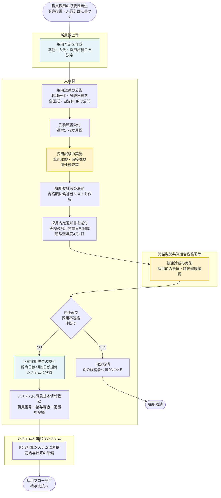
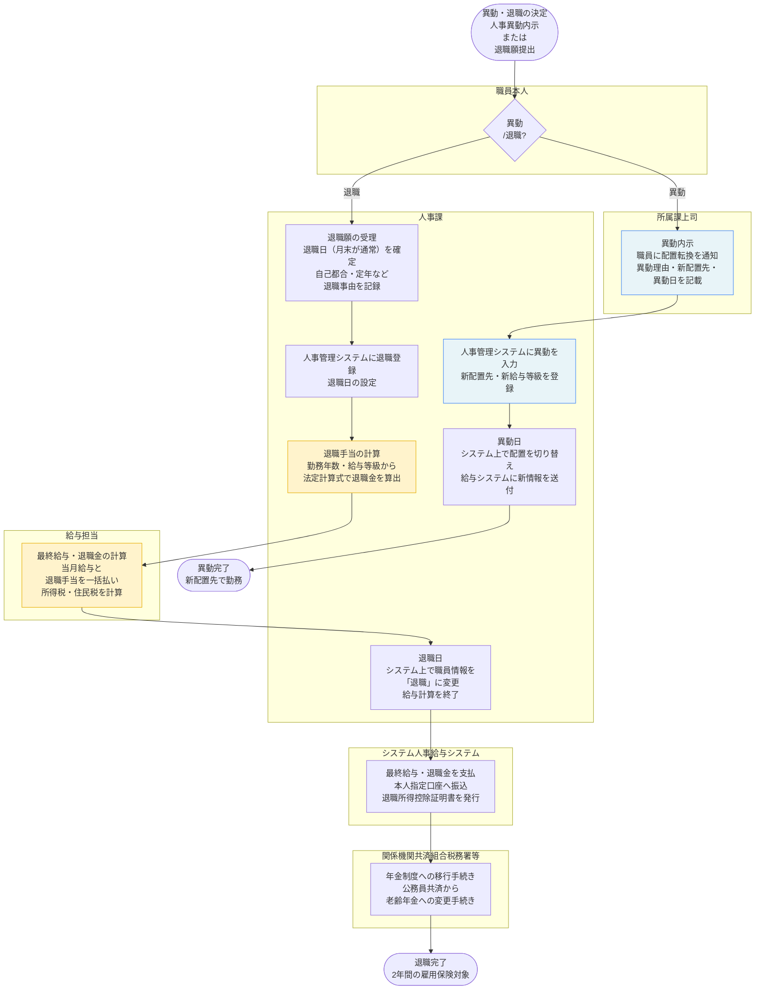
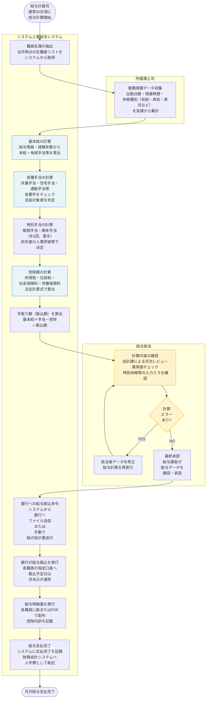

# 人事給与 標準業務フロー

**出典**: 地方自治体職員給与システム標準仕様書【第1.0版】（令和5年、総務省）
**法令**: 地方公務員法 第23条～（人事評価）、第24条～（給与）、第25条（福利厚生）

> このフローは標準仕様書の機能要件に基づく「あるべきフロー」。
> 自治体の現実との差分は `gap-notes.md` を参照。

---

## 職員採用・任用フロー



---

## 異動・退職フロー



---

## 月次給与計算フロー



---

## 人事評価と給与反映フロー

```mermaid
flowchart TD
    Start([評価年度開始\n4月1日]) --> SetGoals

    subgraph 職員本人
        SetGoals[職員に目標設定シート配布\n年間の業務目標・\n成長目標を記入\n管理職が指導]
    end

    SetGoals --> MidReview

    subgraph 所属課上司
        MidReview[中間面談\n半年時点（10月頃）\n目標進捗の確認\n軌道修正]
        FinalReview[最終評価面談\n3月～4月\n 1年間の成果を\n 管理職が評価]
        RatePerformance[人事評価の実施\n4段階評価\n（優秀・良好・標準・要改善）\n または
5段階評価\n を選択]
    end

    MidReview --> FinalReview
    FinalReview --> RatePerformance

    RatePerformance --> DocumentEvaluation

    subgraph 人事課
        DocumentEvaluation[評価票をシステムに登録\n評価結果を記録\n コメント欄に理由を記載]
        ReviewByHeadquarters[人事課による\n評価結果の\nばらつきチェック\n 同じ部門内で\n極端に評価が異なれば\n確認\n調整指導]
        FinalizeEvaluation[評価確定\n職員本人に\n評価結果を\n フィードバック\n 納得性を確保]
        DeterminePay{給与体系\nで評価結果を\n反映?}
        CalcBonus[期末手当・勤勉手当の\n計算に評価を反映\n「良好」以上は加算\n \"要改善\"は減算]
        AdjustAmount[支給額を決定\n評価×係数\nで調整]
    end

    DocumentEvaluation --> ReviewByHeadquarters
    ReviewByHeadquarters --> FinalizeEvaluation
    FinalizeEvaluation --> DeterminePay

    DeterminePay -- 反映あり\n（ボーナス） --> CalcBonus
    DeterminePay -- 反映なし\n（固定給） --> End_NoChange

    CalcBonus --> AdjustAmount

    AdjustAmount --> IncludeInPayroll

    subgraph システム人事給与システム
        IncludeInPayroll[月次給与計算に反映\n次回ボーナス月\n（6月・12月）から\n 新しい評価に基づく\n 金額で支払]
    end

    IncludeInPayroll --> End_OK

    End_NoChange([給与据え置き])
    End_OK([評価・給与反映完了])

    style SetGoals fill:#e8f4f8,stroke:#3b82f6
    style RatePerformance fill:#fff3cc,stroke:#e6ac00
    style ReviewByHeadquarters fill:#fff3cc,stroke:#e6ac00
    style FinalizeEvaluation fill:#fff3cc,stroke:#e6ac00
    style CalcBonus fill:#e8f4f8,stroke:#3b82f6
```

---

## 会計年度任用職員の任用・更新フロー

```mermaid
flowchart TD
    Start([年度末\n3月]) --> PrepareRenewal

    subgraph 人事課
        PrepareRenewal[会計年度任用職員の\n来年度任用要件を確認\n予算化されているか\n 配置は継続か]
        CheckBudget{予算で\n来年度任用\n可能?}
        PrepareOffer[会計年度任用職員に\n来年度任用意思確認\n 4月1日の新規任用か\n 続行か]
        PrepareContracts[任用契約書を作成\n賃金・勤務時間・\n 雇用期間\n （「会計年度内\"\"） を記載]
        SignContract[職員に契約書へ署名させ\n任用契約を交わす\n 雇用保険加入手続き]
    end

    PrepareRenewal --> CheckBudget

    CheckBudget -- NO --> NotRenew

    CheckBudget -- YES --> PrepareOffer

    PrepareOffer --> ReceiveResponse

    subgraph 職員本人
        ReceiveResponse{職員が\n来年度任用を\n 同意?}
    end

    ReceiveResponse -- NO --> LetGo

    ReceiveResponse -- YES --> PrepareContracts

    PrepareContracts --> SignContract

    subgraph システム人事給与システム
        SystemUpdate[3月31日\n旧年度の任用を\n 終了\n システムで\n 職員情報を\n 削除\n 給与計算を中止]
        NewYearUpdate[4月1日\n 新年度として\n 職員を新規登録\n 新しい給与等級を設定\n 給与計算を開始]
        FirstPayment[新年度初回給与計算\n 4月の賃金を計算\n初回ボーナスの\n 取扱いに注意\n （4月採用は対象外など） ]
    end

    SignContract --> SystemUpdate
    SystemUpdate --> NewYearUpdate
    NewYearUpdate --> FirstPayment

    FirstPayment --> End_OK

    subgraph 人事課
        NotRenew[任用しない\n別途募集しないか\n 検討]
        LetGo[任用しない\n別の候補者を\n 公募する\n 場合もある]
    end

    NotRenew --> End_NotRenew
    LetGo --> End_LetGo

    End_NotRenew([任用中止])
    End_LetGo([任用終了])
    End_OK([新年度任用完了])

    style CheckBudget fill:#e8f4f8,stroke:#3b82f6
    style ReceiveResponse fill:#fff3cc,stroke:#e6ac00
    style SystemUpdate fill:#ffcccc,stroke:#cc0000
    style NewYearUpdate fill:#ffcccc,stroke:#cc0000
```

---

## 標準仕様書が定める庁内連携

| 連携先 | 内容 | タイミング |
|---|---|---|
| 人事管理システム | 職員基本情報（採用・異動・退職）、配置情報 | リアルタイム |
| 給与計算システム | 月次給与計算用のマスタ情報、賃金振込データの作成 | 月1回（給与支払時） |
| 財務会計システム | 人件費の支出計上、予算執行データの転記 | 月1回 |
| 健康管理システム | 健康診断記録、長時間勤務者の把握、メンタルヘルス情報 | 随時 |
| 住民基本台帳システム | 通勤経路の住所確認（通勤手当計算）、住所変更の反映 | 異動時・年1回 |
| 公務員共済システム（年金） | 保険料控除、退職時の年金手続き | 月1回・退職時 |

---

## 定年延長制度（令和5年度～）に対応した新しい任用パターン

標準仕様書発行後（令和5年）に「定年延長制度」が施行され、
60歳定年→65歳定年への段階的な移行（10年間）が開始された。

| 職員区分 | 従来（令和4年度まで） | 定年延長制度下（令和5年度～） |
|---|---|---|
| 60歳定年職員 | 定年退職後「再任用職員」として非常勤任用 | 定年を61～65歳に延長、引き続き正規職員扱い |
| 延長勤務職員 | 再任用非常勤として給与低下 | 定年延長により給与・処遇が連続 |
| 短時間勤務者 | 制度なし | 「定年前再任用短時間勤務」で段階的に勤務時間を短縮可能（新制度） |

この変化により、給与計算・人事管理システムの設定が大きく複雑化し、
各自治体がシステムカスタマイズに対応している状況が続いている。
