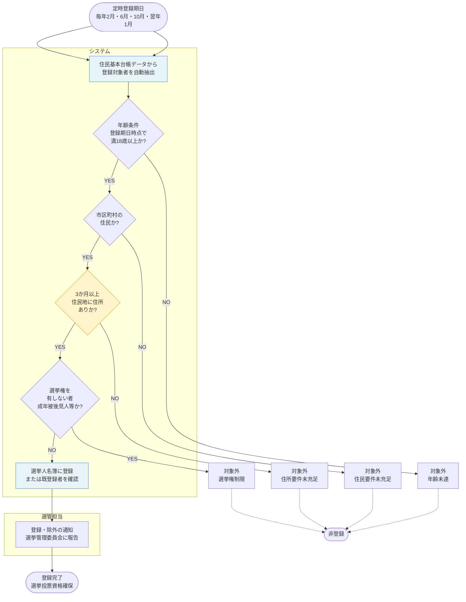

# 選挙人名簿管理 標準業務フロー

**出典**: 公職選挙法及び総務省選挙部通知
**法令**: 公職選挙法 第21条〜30条（選挙人名簿の調製・管理）、第58条（在外選挙人名簿）

> このフローは法令が定める「あるべきフロー」。
> 自治体の現実との差分及び運用上の課題は `gap-notes.md` を参照。

---

## 定時登録（年4回）フロー



---

## 転入・転出に伴う名簿移動フロー

```mermaid
flowchart TD
    Start([住民異動届手続き\n転入・転出]) --> TriggerGW

    subgraph 住民・申請者
        Start
    end

    subgraph 選管担当
        TriggerGW{異動内容}
        TransferIn[転入者について\n選挙人名簿登録要件を確認]
        CheckInAge{転入時点で\n満18歳以上か?}
        CheckInPeriod{転入3か月未満\nか?}
        RegisterIn[新住所地の\n選挙人名簿に登録]
        NotifyIn[都道府県選挙管理委員会に\n報告\n前住所地での抹消手配]
        TransferOut[転出者の\n名簿抹消\n前もって抹消日を設定]
        NotifyOut[抹消日以後は\n転出先で投票\n国外転出は別途処理]
        IntraMunicipal[市区町村内での\n住所変更\n名簿は変更なし]
        WaitAge1[年齢到達待ち\n定時登録対象に]
        Pending1[保留\n旧住所地の名簿で投票\n転入後3か月経過で登録]
    end

    subgraph 関係機関（住民記録・法務局）
        DefTime[定時登録期日に\n満18歳到達者として登録]
        Wait3Months[3か月経過日に\n自動登録へ移行]
        RegisterIn2[登録完了]
    end

    TriggerGW -- 他市区町村から転入 --> TransferIn
    TriggerGW -- 他市区町村へ転出 --> TransferOut
    TriggerGW -- 市区町村内異動 --> IntraMunicipal

    TransferIn --> CheckInAge

    CheckInAge -- NO --> WaitAge1
    CheckInAge -- YES --> CheckInPeriod

    CheckInPeriod -- YES --> Pending1
    CheckInPeriod -- NO --> RegisterIn

    RegisterIn --> NotifyIn

    TransferOut --> NotifyOut

    IntraMunicipal --> EndIntra([投票地は\n新住所地での投票])

    WaitAge1 --> DefTime

    Pending1 --> Wait3Months

    DefTime --> End_OK([登録完了])
    Wait3Months --> RegisterIn2
    RegisterIn2 --> End_OK
    NotifyIn --> End_OK
    NotifyOut --> End_OK([抹消完了])

    style TransferIn fill:#e8f4f8,stroke:#3b82f6
    style CheckInPeriod fill:#fff3cc,stroke:#e6ac00
    style Pending1 fill:#fff3cc,stroke:#e6ac00
```

---

## 在外選挙人名簿登録フロー

```mermaid
flowchart TD
    Start([在外投票申請\n海外赴任・留学者]) --> CheckResidence

    subgraph 住民・申請者
        Start
    end

    subgraph 選管担当
        CheckResidence[国内での最後の\n住所地を確認\n住民基本台帳から抽出]
        CheckAge{満18歳\n以上か?}
        CheckCitizen{日本国民か?}
        CheckStay[海外在住期間\n確認書・申告書取得]
        CheckDocs{必要書類\nそろっているか?}
        TempAccept[仮受付\n後日提出依頼]
        Reminder[期限内に\n書類確認催促]
        RegisterAfter[書類完備後登録]
        IssueCert[在外選挙人証明書\n発行・返送\nまたはマイナカード利用登録]
    end

    subgraph システム
        Register[在外選挙人名簿に\n登録\n投票用紙郵送手配]
    end

    CheckResidence --> CheckAge

    CheckAge -- NO --> Reject1[申請受付不可\n年齢未達]
    CheckAge -- YES --> CheckCitizen

    CheckCitizen -- NO --> Reject2[申請受付不可\n国籍要件未充足]
    CheckCitizen -- YES --> CheckStay

    CheckStay --> CheckDocs

    CheckDocs -- NO --> TempAccept
    CheckDocs -- OK --> Register

    TempAccept --> Reminder
    Reminder --> RegisterAfter
    RegisterAfter --> IssueCert

    Register --> IssueCert

    IssueCert --> End_OK([登録完了\n海外での投票可能])

    Reject1 -.-> End_NG([申請却下])
    Reject2 -.-> End_NG

    style CheckResidence fill:#e8f4f8,stroke:#3b82f6
    style CheckStay fill:#fff3cc,stroke:#e6ac00
    style IssueCert fill:#e8f4f8,stroke:#3b82f6
```

---

## 選挙期間中の資格確認・投票フロー

```mermaid
flowchart TD
    Start([選挙期日前後\n投票日1か月前から投票日まで]) --> CheckPhase

    subgraph 住民・申請者
        Start
    end

    subgraph 選管担当
        CheckPhase{時期}
        EarlyVote[期日前投票所での\n本人確認]
        DayVote[投票所での\n本人確認]
        CheckListEarly{選挙人名簿に\n登録されているか?}
        CheckListDay{選挙人名簿に\n登録されているか?}
        BallotEarly[投票用紙交付\n投票実施]
        BallotDay[投票用紙交付\n投票実施]
        CheckPending{保留中\nまたは確認中か?}
        TentativeVote[仮投票\n投票の有効性は\n後日確認]
        Reject[投票不可\n資格要件未充足]
        LateTransfer[投票日前日までに\n転入した者の扱い]
        CheckNewList{転出地での\n投票登録\n確認できるか?}
        VoteOld[転出地での\n投票可能\n郵便投票など対応]
        VoteNew[転入地での\n仮投票\n有効性を後日確認]
        Record[投票実績記録\n選挙人名簿に投票日記入]
    end

    subgraph 関係機関（法務局・住民記録）
        CheckValid[仮投票の有効性判定\n本人確認後確定]
        ValidYes[投票有効]
        ValidNo[投票無効]
    end

    CheckPhase -- 期日前投票期間 --> EarlyVote
    CheckPhase -- 投票日当日 --> DayVote
    CheckPhase -- 期日前投票終了\n投票日までの新規転入 --> LateTransfer

    EarlyVote --> CheckListEarly
    DayVote --> CheckListDay

    CheckListEarly -- YES --> BallotEarly
    CheckListEarly -- NO --> CheckPending

    CheckListDay -- YES --> BallotDay
    CheckListDay -- NO --> CheckPending

    CheckPending -- YES --> TentativeVote
    CheckPending -- NO --> Reject

    LateTransfer --> CheckNewList

    CheckNewList -- YES --> VoteOld
    CheckNewList -- NO --> VoteNew

    BallotEarly --> Record
    BallotDay --> Record
    TentativeVote --> CheckValid

    CheckValid --> ValidYes
    CheckValid --> ValidNo

    VoteOld --> Record
    VoteNew --> Record

    Record --> End_OK([投票完了\n開票集計])

    Reject -.-> End_NG([投票受付不可])
    ValidNo -.-> End_NG

    style CheckListEarly fill:#e8f4f8,stroke:#3b82f6
    style TentativeVote fill:#fff3cc,stroke:#e6ac00
    style CheckValid fill:#fff3cc,stroke:#e6ac00
```

---

## 標準仕様書が定める庁内連携

| 連携先 | 内容 | タイミング |
|---|---|---|
| 住民基本台帳システム | 転入・転出・年齢確認データの自動受信 | 定時登録時（年4回）及び随時 |
| 都道府県選挙管理委員会 | 名簿登録・抹消の報告、転入者の前住所地抹消手配 | 登録・抹消時、随時 |
| 全国市区町村の選挙管理委員会 | 転出者の前住所地名簿からの抹消確認 | 転出手続き時 |
| 最高裁判所（後見登録） | 成年後見人などの情報受領（選挙権制限者確認） | 定時登録時 |
| 外務省（在外邦人名簿） | 在外選挙人の資格確認（連携予定） | 在外選挙人登録・抹消時 |

---

## 選挙人名簿登録の基本ルール

| 項目 | 内容 |
|---|---|
| 登録要件 | 日本国民・満18歳以上・市区町村3か月以上住所 |
| 定時登録期日 | 毎年2月1日・6月1日・10月1日・翌年1月1日 |
| 転入3か月ルール | 転入から3か月未満は前住所地で投票、3か月経過後は新住所地で投票 |
| 登録抹消事由 | 転出・75歳到達者（老齢年金受給と混同される）・成年後見人就任など |
| 在外選挙人登録 | 国内での住所地から海外転出する際に任意申請 |
| 投票方法 | 期日前投票・投票日当日投票・郵便投票・在外投票 |
