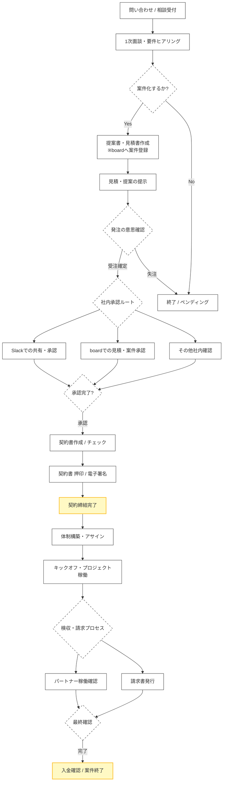

# その他 標準業務フロー

**出典**: 組織の業務一般フロー
**法令**: -

> このフローは組織の一般的な業務フロー（相談受付〜入金・案件終了）を表す。
> 特定業務の KB が存在しない「その他」セクションのデフォルト標準フローとして使用する。

---

## 業務一般フロー（相談受付〜入金）

```mermaid
graph TD
    %% スタイル定義
    classDef default fill:#ffffff,stroke:#333,stroke-width:1px;
    classDef cond fill:#fff,stroke:#333,stroke-dasharray: 5 5;
    classDef milestone fill:#fff9c4,stroke:#fbc02d,stroke-width:2px;

    %% 1. 相談・ヒアリングフェーズ
    A[問い合わせ / 相談受付] --> B[1次面談・要件ヒアリング]
    B --> C{案件化するか?}:::cond

    %% 2. 提案・見積もりフェーズ
    C -- Yes --> D[提案書・見積書作成<br>※boardへ案件登録]
    D --> E[見積・提案の提示]
    E --> F{発注の意思確認}:::cond

    %% 3. 社内稟議・承認フェーズ（中盤の並列処理）
    F -- 受注確定 --> G{社内承認ルート}:::cond
    G --> G1[Slackでの共有・承認]
    G --> G2[boardでの見積・案件承認]
    G --> G3[その他社内確認]

    G1 --> H{承認完了?}:::cond
    G2 --> H
    G3 --> H

    %% 4. 契約手続きフェーズ
    H -- 承認 --> I[契約書作成 / チェック]
    I --> J[契約書 押印 / 電子署名]
    J --> K[契約締結完了]:::milestone

    %% 5. プロジェクト稼働フェーズ
    K --> L[体制構築・アサイン]
    L --> M[キックオフ・プロジェクト稼働]

    %% 6. 請求・入金フェーズ（終盤の並列処理）
    M --> N{検収・請求プロセス}:::cond
    N --> N1[パートナー稼働確認]
    N --> N2[請求書発行]

    N1 --> O{最終確認}:::cond
    N2 --> O

    O -- 完了 --> P[入金確認 / 案件終了]:::milestone

    %% 例外ルート
    C -- No --> End[終了 / ペンディング]
    F -- 失注 --> End
```
