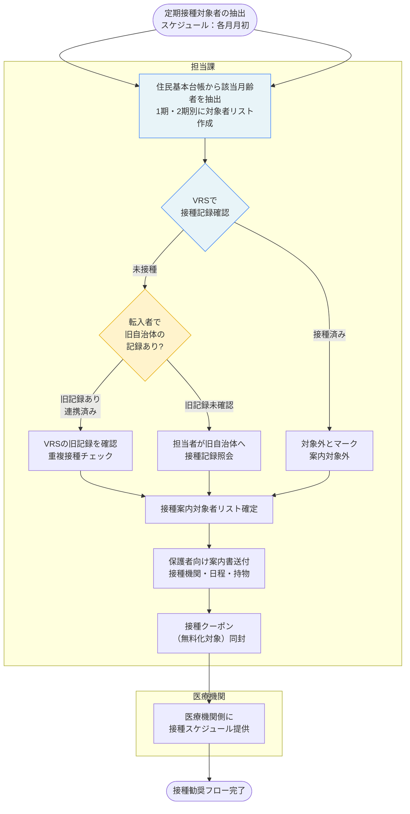
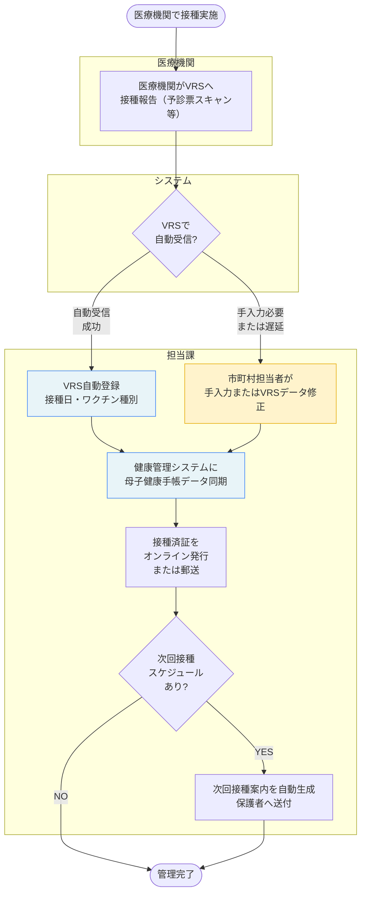
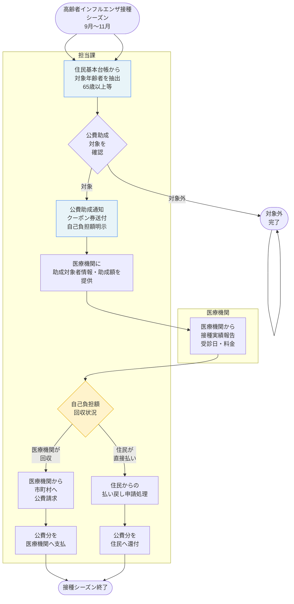

# 予防接種 標準業務フロー

**出典**: 予防接種に関する標準仕様書【第1.0版】（令和5年、厚生労働省）
**法令**: 予防接種法 第4条～（定期接種）、第5条～（臨時接種）

> このフローは標準仕様書の機能要件に基づく「あるべきフロー」。
> 自治体の現実との差分は `gap-notes.md` を参照。

---

## 定期接種対象者管理フロー



---

## 接種記録管理・入力フロー



---

## 転入者の接種歴確認フロー

```mermaid
flowchart TD
    Start([転入者\n住民異動届提出]) --> ReceiveApplication

    subgraph 住民・対象者
        ReceiveApplication[転入者から転入前の\n接種記録有無を確認]
    end

    subgraph システム
        QueryVRS{新自治体VRSに\nすでに\n情報あり?}
    end

    ReceiveApplication --> QueryVRS

    QueryVRS -- 自動連携済み --> ConfirmData
    QueryVRS -- 未受信 --> RequestOldCity

    subgraph 担当課
        ConfirmData[転入元自治体から\n連携された記録を確認]
        RequestOldCity[転入元市町村へ\n接種記録照会依頼]
        ReceiveRecord[転入元からの回答待ち\n通常1～2週間]
        AssessGaps[接種漏れ・重複がないか\n確認・シミュレーション]
        GapGW{接種漏れ\nまたは\n不明な期間?}
        CreatePersonalPlan[個別予防接種予定表を\n保護者へ提供\n接種スケジュール提案]
        SendConfirm[接種済み確認書送付\nマイナポータル登録誘導]
    end

    ConfirmData --> AssessGaps
    RequestOldCity --> ReceiveRecord
    ReceiveRecord --> AssessGaps

    AssessGaps --> GapGW

    GapGW -- YES --> CreatePersonalPlan
    GapGW -- NO --> SendConfirm

    CreatePersonalPlan --> End_OK([手続き完了])
    SendConfirm --> End_OK

    style QueryVRS fill:#e8f4f8,stroke:#3b82f6
    style ReceiveRecord fill:#fff3cc,stroke:#e6ac00
    style AssessGaps fill:#fff3cc,stroke:#e6ac00
```

---

## 高齢者インフルエンザ等任意接種（公費助成）フロー



---

## 標準仕様書が定める庁内連携

| 連携先 | 内容 | タイミング |
|---|---|---|
| 住民基本台帳システム | 年齢階級別対象者の月次抽出 | 毎月月初 |
| ワクチン記録システム(VRS) | 接種記録の登録・参照、全国連携 | リアルタイム（入力遅延あり） |
| 健康管理システム | 母子健康手帳データとの連携、妊婦接種の記録 | 接種後即日 |
| 医療機関 | 接種予定・実績・副反応報告の共有 | 月1回以上 |
| 保健所 | 感染症流行情報・接種勧奨方針の受信 | 随時 |

---

## VRS（ワクチン記録システム）の位置付け

定期接種・臨時接種の記録をオンラインで一元管理し、予診票スキャンや医療機関の電子カルテとの連携により、
市町村の手入力業務を軽減することが標準仕様書の理想。
ただし導入状況・運用の成熟度は自治体によって大きな差がある。

| 項目 | 現状のVRS機能 |
|---|---|
| 自動入力対象 | 医療機関の電子カルテ連携、予診票スキャン取込のみ |
| 手入力が必要な場合 | 紙予診票、転入者の旧記録、VRS未対応医療機関の報告 |
| 都道府県間の連携 | 全国ネットワークだが、開示権限の制限あり |
| マイナカード搭載 | 令和6年度末までに完全実装予定 |
