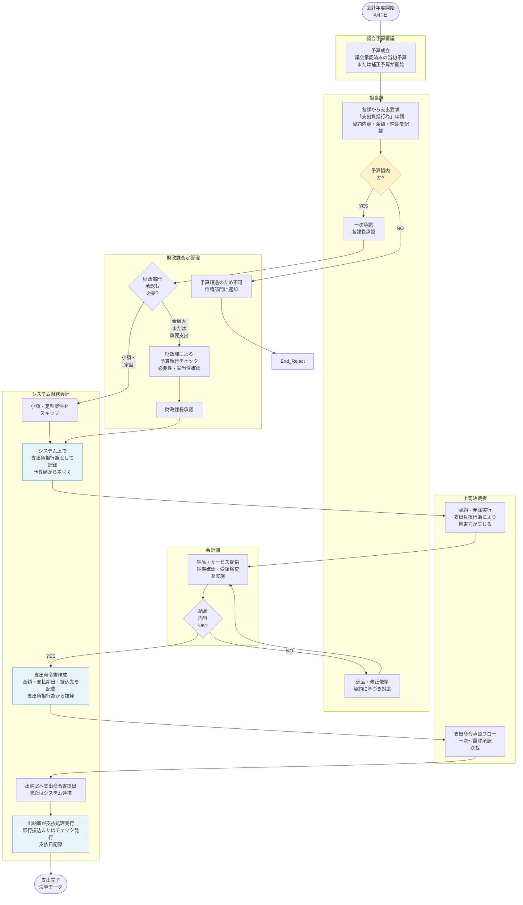
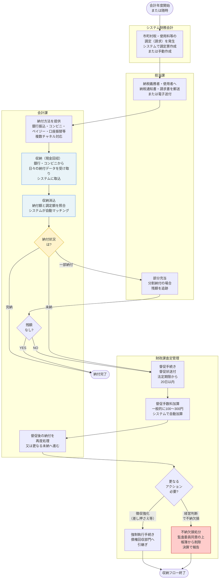
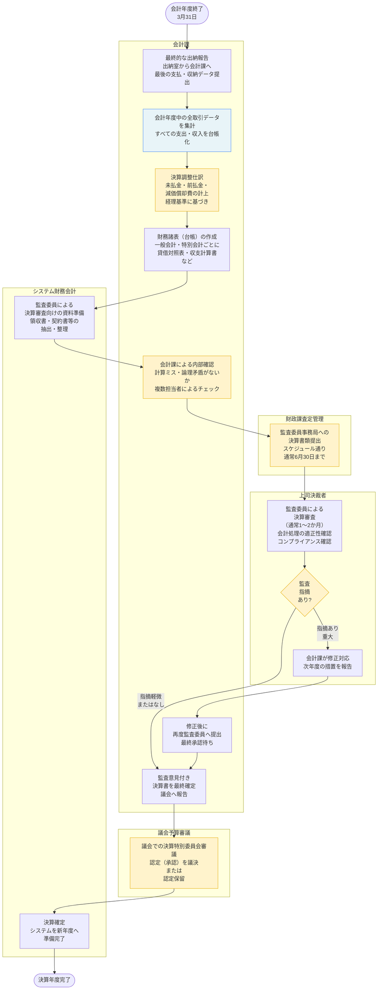

# 財務会計 標準業務フロー

**出典**: 地方自治体における財務会計システム標準仕様書【第1.0版】（令和5年、総務省）
**法令**: 地方自治法 第211条～（予算）、第232条の4～（支出の手続き）、第233条（収入の調定）

> このフローは標準仕様書の機能要件に基づく「あるべきフロー」。
> 自治体の現実との差分は `gap-notes.md` を参照。

---

## 支出フロー（予算執行サイクル）

---

## 収入フロー（年度通期）

---

## 決算調製フロー（年度末～翌年度初期）

---

## 標準仕様書が定める庁内連携

| 連携先 | 内容 | タイミング |
|---|---|---|
| 各課（予算部門） | 支出負担行為・支出命令の申請・承認 | 随時（通年） |
| 出納室 | 支払処理の実行、現金・銀行口座管理 | 随時（通年） |
| 税務部門 | 市町村税の調定・収納・決算データ | 月次・年次 |
| 監査委員事務局 | 決算書類の審査 | 6月中旬～8月下旬 |
| 議会事務局 | 決算認定議案の提出・報告 | 8月～9月 |
| 企画財政部門 | 予算編成に向けた決算分析、決算情報の政策展開への活用 | 10月～12月 |

---

## 支出負担行為～支払の手続きの多様性

標準仕様書は「支出負担行為」「支出命令」「支払」の3段階の手続きを定めるが、
各段階での承認権者・承認基準・システム処理は自治体ごとに大きく異なる。

| 項目 | 標準仕様書での取扱い | 現実の多様性 |
|---|---|---|
| 支出負担行為の承認権限 | 原則課長、金額大は部長以上 | 自治体ごとに金額基準が異なる（50万、100万、など） |
| 支出命令の承認権限 | 原則課長、監査委員制度がある場合は監査委員承認 | 監査委員への報告時期・報告範囲が自治体で異なる |
| 決裁印鑑の使用 | 電子決裁またはハンコ | 混在（紙文書は判子、システムは電子決裁） |
| 支払遅延時の利息 | 契約書に明記する | 自治体によって遅延利息計算が異なる（年5%か年3%か） |
