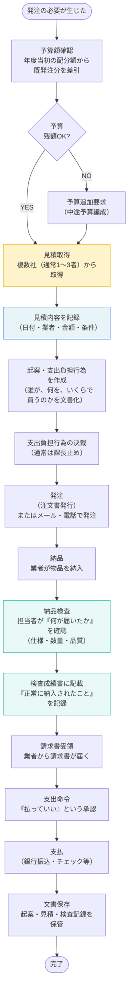

# 軽微発注・納品検査 典型業務フロー

## 軽微発注とは

**定義**: 随意契約が許可される金額以下の物品購入・修繕・印刷・役務等の発注のこと。

**金額基準**（地方自治法施行令 第167条の2）:

| カテゴリ | 限度額 |
|---|---|
| **工事** | 250万円以下 |
| **物品購入** | 100万円以下 |
| **役務（印刷・委託等）** | 100万円以下 |

※ 上記を超える場合は「競争入札」が必須。分割して限度額以下にすることは許可されない（脱法的運用）。

---

## 典型的な全体フロー



---

## 詳細フロー：物品購入の例

```mermaid
flowchart TD
    Start([物品購入の必要]) --> Define["仕様定義\n『何が必要か』を明確化\n（機能・色・サイズ等）"]

    Define --> CheckBudget["予算確認\n購入予定額が予算内か"]

    CheckBudget --> BudgetGW{予算\nOK?}
    BudgetGW -- NO --> Error["予算不足により\n発注延期または中止"]
    BudgetGW -- YES --> GetQuote

    Error --> End_Cancel([中止])

    GetQuote["見積依頼\nメール・電話で\n複数社に見積依頼"]

    GetQuote --> ReceiveQuote["見積回答受領\n（通常3〜7営業日で返答）"]

    ReceiveQuote --> CompareQuote["見積比較\n金額・納期・条件を比較\n（最安値？内容？納期？）"]

    CompareQuote --> RecordQuote["見積記録\n見積書を保存\n（後で説明責任が問われるため）"]

    RecordQuote --> SelectVendor["業者選定\n『この業者で発注する』\nを決定"]

    SelectVendor --> Drafting["起案・支出負担行為作成\n『△△会社から\n○○を¥○○,○○○で買う』"]

    Drafting --> Approval["決裁\n（通常は課長決裁）"]

    Approval --> Order["発注実行\n『注文します』\nをメール・電話・注文書で伝える"]

    Order --> OrderConfirm["発注確認\n業者から『承けました』\nの返答確認"]

    OrderConfirm --> Wait["納期待機\n（通常1〜4週間程度）"]

    Wait --> Delivery["納品\n業者から物品が届く\n（梱包・運送状況確認）"]

    Delivery --> Unpack["開梱・確認\n『中身は何か』『壊れていないか』"]

    Unpack --> SpecCheck["仕様確認\n『注文したものと同じか』\n色・サイズ・機能確認"]

    SpecCheck --> QuantityCheck["数量確認\n『注文数分揃っているか』"]

    QuantityCheck --> QualityCheck["品質確認\n『傷・汚れ・不具合ないか』"]

    QualityCheck --> CheckResult{OK?}

    CheckResult -- NG：不良品 --> ReturnRequest["返品・交換依頼\n業者に連絡"]
    CheckResult -- OK --> InspectionRecord["検査成績書作成\n『正常に受け取った』を記録"]

    ReturnRequest --> Redelivery["再納品\n不良品返送\n正品受取"]
    Redelivery --> InspectionRecord

    InspectionRecord --> Invoice["請求書受領\n業者から『これだけ\nお支払いください』"]

    Invoice --> PaymentOrder["支出命令\n会計部で『いくら払う』\nを承認"]

    PaymentOrder --> Payment["支払実行\n銀行振込等で支払"]

    Payment --> Archive["文書保存\n起案・見積・注文書・\n検査記録・請求書・\n支出命令を一式保管"]

    Archive --> End([完了])

    style GetQuote fill:#fff3cc,stroke:#e6ac00
    style CompareQuote fill:#fff3cc,stroke:#e6ac00
    style RecordQuote fill:#e8f4f8,stroke:#3b82f6
    style Inspection fill:#e8f9f7,stroke:#10b981
    style QualityCheck fill:#e8f9f7,stroke:#10b981
```



---

## 随意契約の金額限度額（詳細表）

出典：地方自治法施行令 第167条の2

| 契約の種類 | 限度額 | 補足 |
|---|---|---|
| **工事** | 250万円 | 土木・建築・設備工事等 |
| **製造** | 250万円 | 物品の製造委託 |
| **物品購入** | 100万円 | 消耗品・備品・機器等 |
| **役務（業務委託）** | 100万円 | 清掃・警備・保守・印刷・翻訳等 |
| **委託（その他）** | 100万円 | 設計・調査・コンサル等 |

**重要な原則**:
- 限度額を**分割してはいけない**（年間に複数回、同一業者に小分けして注文する「脱法的分割発注」はNG）
- ただし、同じ品目でも別の用途・別の時期なら、それぞれ限度額としてカウント（例：4月に事務用品50万円、9月に違う課で事務用品50万円は可）

---

## 見積取得の標準的なプロセス

### 1者見積の場合

```
通常は100万円以下の小額案件。
特定の業者にしか頼めない（レアな製品・専門性が高い）場合のみ。

【流れ】
→ その業者に見積依頼
→ 返答受領
→ そのまま発注（比較なし）

【ただし】
- 見積書を保存する（「なぜこの業者を選んだのか」と後で聞かれるため）
- 「この業者にしかできない理由」を記録しておく
```

### 2者以上の見積合わせ

```
通常は50万円以上の案件。
複数社に見積依頼して、「最良の条件」で選ぶ。

【流れ】
→ 2〜3社に同じ条件で見積依頼
→ 見積回答を比較
  ・単価が安い？
  ・納期が短い？
  ・品質が良い（定評がある）？
  ・過去の取引実績は？
→ 総合判断で業者決定
→ 発注

【記録に残す】
- 見積依頼日、依頼先
- 見積回答内容（金額・納期・仕様）
- 「なぜこの業者を選んだのか」の理由
  例）「A社¥80,000、B社¥95,000、C社¥110,000
       A社が最安値で、過去の納入実績も良好のため選定」
```

---

## 納品検査の実施方法

### パターン1：物品購入の場合

```
納品 → 開梱 → 内容確認 → 検査成績書に記載 → 完了

【確認項目】
- 数量：注文通りの個数か
- 品質：傷・汚れ・不具合がないか
- 仕様：色・サイズ・機能が注文通りか
- 納期：指定日までに届いたか

【記録】
検査成績書に以下を記載：
 ・納品日
 ・受け取った物品（品名・型番・数量）
 ・検査者の確認印
 ・問題がある場合は「NG」と記載し、
   業者に返品・交換を依頼
```

### パターン2：役務（サービス）の場合

```
例：清掃業務、警備業務、印刷業務

納品 → 成果物確認 → 仕様通りか確認 → 検査成績書

【確認項目】
- 清掃：指定エリアが清潔か（目視確認）
- 警備：指定時間に配置されているか（シフト確認）
- 印刷：色合い・製本・ページ数が指定通りか
```

### パターン3：工事の場合（小規模修繕等）

```
工事完了 → 現地検査 → 施工状況確認 → 検査成績書

【確認項目】
- 指定の箇所が修理されているか
- 材質・色合いが仕様通りか
- 安全上の問題がないか
- 工期内に完了したか
```

---

## よくある発注パターン

| 発注内容 | 金額 | 見積取得 | 検査方法 | 納期 |
|---|---|---|---|---|
| **消耗品（コピー紙・トナー等）** | 5〜30万円 | 1〜2社 | 開梱確認 | 3〜5営業日 |
| **印刷（チラシ・パンフ等）** | 10〜50万円 | 2社以上 | 見本確認 | 1〜2週間 |
| **小規模修繕（器具修理・塗装等）** | 50〜200万円 | 2社以上 | 現地検査 | 1〜4週間 |
| **設備保守契約** | 20〜100万円/年 | 1社（継続） | 月次報告確認 | 継続 |
| **業務委託（翻訳・データ入力等）** | 10〜100万円 | 1〜2社 | 成果物確認 | 納期指定 |

---

## 庁内の関連部門

| 部門 | 関わり方 | タイミング |
|---|---|---|
| 財務・会計部門 | 支出負担行為の決裁 / 支出命令 | 発注前・支払前 |
| 契約担当部門 | 契約書作成（大型案件のみ） | 発注前 |
| 検査部門 | 大規模工事の検査 | 工事完了後 |
| 監査部門 | 随意契約の適正性確認 | 年1回の監査時 |

---

## 発注から支払までの標準期間

| フェーズ | 期間 | 内容 |
|---|---|---|
| **見積取得〜決裁** | 3〜7営業日 | 見積依頼・比較・起案・決裁 |
| **発注〜納品** | 1〜4週間 | 業者の納期に依存 |
| **納品〜検査** | 1〜3営業日 | 検査成績書作成 |
| **請求書受領〜支払** | 1〜2営業日 | 会計部で支出命令 |
| **全体** | **約2〜5週間** | 案件規模による |

---

## 発注文書（起案・支出負担行為）の例

```
【支出負担行為兼発注書】

発注部門：企画課
発注日：2026年4月6日
決裁者：○○課長

【発注内容】
品　　名：コピー用紙（A4、白色、500枚/冊）
数　　量：20冊
単　　価：¥450/冊
合計金額：¥9,000

【業者情報】
業者名：◎◎オフィス用品店
所在地：◎◎市◎◎区
担当者：△△さん
電話：0××-××××-××××

【納期】
2026年4月10日までに納入

【備考】
見積依頼先：◎◎オフィス（¥450）、■■商社（¥480）、▲▲店（¥520）
選定理由：最安値で、過去納入実績良好

【検査予定者】
企画課 □□（受け取り・開梱確認）
```

---

## 支払完了までのチェックリスト

```
□ 見積取得 & 記録保存
□ 起案・支出負担行為作成
□ 決裁取得
□ 業者に発注（メール・電話・注文書）
□ 納品受け取り
□ 検査実施（仕様確認・数量確認・品質確認）
□ 検査成績書作成・署名
□ 請求書受領・内容確認
□ 支出命令作成・決裁
□ 支払実行（銀行振込）
□ 全文書（起案・見積・検査・請求・支出命令）を一式保存
□ 完了報告
```
