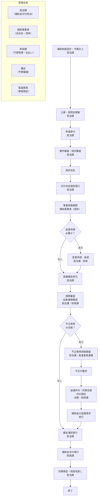

# 補助金管理（自治会・まちづくり団体）

## 業務概要

自治会（町内会）、まちづくり団体、地域系NPOなどの地域活動団体に対する補助金の交付・管理業務。予算計上から制度設計、公募・説明会開催、申請受付、審査、交付決定、事業実施支援、実績報告受付、精算審査、確定通知、補助金交付（または返還命令）に至るまでの全期間を管理する。補助金の透明性確保、不正使用防止、補助目的の達成を図る必要がある。

## 補助金の類型

| 補助金区分 | 対象事業 | 交付期間 | 予算規模 | 主な特徴 |
|---|---|---|---|---|
| 自治会等組織運営補助 | 自治会の運営経費（会議開催、啓発活動、地域集会施設運営など） | 継続（年度毎） | 月額数千～数万円 | 維持的性質、毎年度の継続が前提 |
| 地域活動事業補助 | 防災訓練、祭り・イベント、環境美化、福祉活動など | 単年度～複数年度 | 5万～100万円程度 | 特定事業を対象、成果検証が必要 |
| まちづくり推進補助（プロジェクト型） | 地域課題解決型プロジェクト、地域資源活用、コミュニティビジネス等 | 複数年度（3年程度） | 50万～数百万円 | 自主的・創意的な取組、成長段階に応じた支援 |

## ワークフロー

## 各ステップの補足説明

### 1. 補助制度設計・予算計上
- **実施主体**: 担当課、企画財政課（予算部局）
- **主な業務**:
  - 補助制度の新規創設または継続判断
  - 補助対象経費の明確化（補助対象外経費の詳細定義）
  - 交付要件・採択基準の設定
  - 予算査定・予算化
  - 交付規則・要綱の制定・改正（必要時）
- **根拠法令**: 地方自治法第232条の2、補助適正化法第3条
- **注意点**: 毎年度、前年度実績を踏まえ制度の妥当性を評価し、陳腐化した補助金は廃止・縮小を検討する

### 2. 公募・説明会開催
- **実施主体**: 担当課
- **主な業務**:
  - 公募要領の作成・配布
  - 説明会開催（対面・オンライン）
  - 質問への回答（事前相談時の回答内容の記録・統一）
  - 補助対象経費の解釈の徹底（担当者間の認識統一）
- **留意点**: 補助対象経費の判断基準を明文化し、申請団体に周知。後で「この経費は対象か」という問い合わせが来た場合の統一的回答ができるようにする

### 3. 申請受付・要件審査
- **実施主体**: 担当課
- **主な業務**:
  - 申請書類の受付（締切管理）
  - 要件審査（対象団体か、必須書類は揃っているか、資格要件を満たしているか）
  - 不適格申請の差戻し
- **根拠**: 補助適正化法第4条（補助事業者の要件確認）

### 4. 採択審査
- **実施主体**: 担当課（プロジェクト型は選考委員会設置）
- **主な業務**:
  - 事業計画書・予算書の内容精査
  - 必要性・実現性・波及効果の評価
  - 予算額の妥当性確認（見積書比較、相場確認）
  - 優先順位付け
- **基準**: 採択基準を客観的に設定し、評価内容を記録に残す

### 5. 交付決定通知
- **実施主体**: 担当課
- **内容**:
  - 交付額の明記
  - 補助事業者が遵守すべき条件の提示
  - 実績報告の提出期限・方法
  - 添付資料・様式の提供
- **根拠**: 補助適正化法第5条

### 6. 事業実施期間
- **実施主体**: 補助事業者（自治会・団体）
- **担当課の支援**:
  - 進捗状況の定期報告（中間報告）要求（プロジェクト型）
  - 問い合わせへの対応
  - 適切に事業が進行しているか確認
- **団体側の義務**:
  - 交付決定の内容に従って事業を実施
  - 変更が生じた場合は速やかに申告
  - 領収書・請求書などの証拠書類を保管

### 7. 変更申請（必要時）
- **対象となる変更**:
  - 事業内容の変更（内容が交付決定時と異なる場合）
  - 事業期間の延長
  - 支出額の大幅変更（予算額の20%以上など）
  - 補助対象経費の追加・削減
- **手続き**: 変更申請書を提出し、事前に担当課の承認を得る

### 8. 実績報告受付
- **実施主体**: 担当課
- **提出物**:
  - 実績報告書（事業内容・参加者数・効果等）
  - 領収書・請求書の写し
  - 写真・成果物（事業内容による）
  - 前払金を受け取った場合は返金報告
- **受付期限**: 事業完了後、通常30日以内
- **注意**: 実績報告書が「形骸化」しないよう、実際に事業が実施されたかを確認する必要がある

### 9. 精算審査（証拠書類確認）
- **実施主体**: 担当課、財政課
- **確認事項**:
  - 領収書の真正性（日付、金額、宛先、押印の確認）
  - 支出が補助対象経費に該当しているか
  - 支出額が提出予算と齟齬がないか
  - 二重補助でないか（他の補助金との重複受給）
  - 支出総額が交付額を超えていないか
- **根拠**: 補助適正化法第6条、地方自治法第234条（支出負担行為）
- **書類保存**: 領収書は5年以上保管（地方自治法施行令第166条）

### 10. 不正使用の確認と対応
- **確認される不正の例**:
  - 架空請求（実際の支出がないのに領収書を偽造）
  - 水増し請求（実際の支出より多い金額を記載）
  - 私的流用（補助対象外の個人的支出に補助金を使用）
  - 領収書の日付改ざん
  - 他団体との架空取引
- **対応フロー**:
  1. 不正の兆候を発見した場合、担当課が詳細調査
  2. 監査委員に報告（監査委員設置団体）
  3. 不正が確定した場合、法務課・財政課と協議
  4. 返還命令を発行（支払い期限を設定）
  5. 返還がない場合は債務者の財産調査・差押えを検討
  6. 刑事告発の検討（詐欺罪、横領罪など）

### 11. 確定通知
- **実施主体**: 担当課
- **内容**: 確定補助金額を通知
- **根拠**: 補助適正化法第7条

### 12. 補助金交付（または返還命令）
- **正常系**: 財政課が補助事業者に補助金を支払い（銀行振込）
- **不正発覚時**: 返還命令を発行し、期限までの返金を求める
- **時間経過での対応**: 返還期限経過後は強制徴収手続きを開始

### 13. 効果検証・制度見直し
- **実施主体**: 担当課
- **確認事項**:
  - 補助金により期待した効果が生まれたか
  - 補助事業者の自立性は向上したか
  - 補助の継続が必要か、廃止・縮小すべきか
- **実施周期**: 3年～5年を目安に定期的に実施
- **結果の反映**: 見直し結果を翌年度予算・制度改正に反映

## 関連法令・制度

- 地方自治法第232条の2（補助金）
- 補助金等に係る予算の執行の適正化に関する法律（補助適正化法）
- 地方自治法施行令第164～166条（支出管理）
- 各市町村の補助金交付規則・要綱
- 地方自治法第235条（監査）

## 関連業務

- 契約・発注業務：補助事業者が提供するサービス・物品の調達
- 予算編成業務：補助金予算の計上・配分
- 監査業務：補助金交付先の会計監査（監査委員）
- 情報公開：補助金交付先・交付額の公表（補助適正化法第8条）
