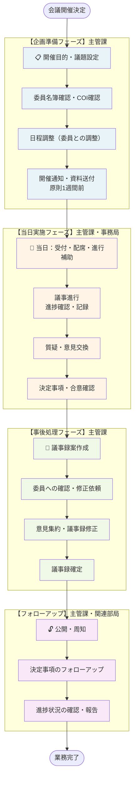

# 外部会議ロジスティクス（審議会・有識者会議・ケース会議）

## 業務概要

外部会議ロジスティクスは、自治体が開催する各種審議会、有識者会議、ケース会議の企画・準備・実施・記録に関わる一連の業務プロセスです。法令に基づく審議会から福祉ケース会議まで、異なる法的根拠や目的を持つ会議を効率的かつ適切に運営するための業務流です。

## 対象会議の類型

| 会議類型 | 法的根拠 | 目的・機能 | 頻度・周期 | 記録の公開性 |
|---------|--------|---------|---------|---------|
| 審議会 | 自治体の条例等 | 重要施策の審議、計画策定、報告受領 | 月1～3回程度 | 原則公開（非開示情報除く） |
| 有識者会議 | 要綱等 | 専門的観点からの検討、助言 | 数回の限定的開催 | 非公開または限定公開 |
| ケース会議 | 法令（児童福祉法等）・要綱 | 個別ケースの情報共有、支援調整 | 案件発生時の随時開催 | 秘密（個人情報保護） |

### ケース会議の主な例

- **要保護児童対策地域協議会** — 児童福祉法により設置。虐待など要保護児童の情報共有・支援方針協議
- **地域ケア会議** — 介護保険法等の枠組みで実施。個別高齢者の支援課題の抽出と支援体制構築

## ワークフロー図

## プロセス詳細と補足説明

### 1. 開催目的・議題設定

**主責部門**: 主管課（会議を主催する部局）

- 会議の開催目的を明確にする（法定審議義務、計画策定、情報共有など）
- 議題・討議内容を確定
- 必要な資料・報告書を洗い出す
- 開催に必要な予算・会場を確保

**補足**:
- ケース会議の場合は、対象個別ケースの情報を整理し、どの機関の参加が必要かを検討する段階
- 有識者会議の場合は、求める助言内容を明確に設定することが後の委員選定に重要

### 2. 委員名簿確認・COI確認

**主責部門**: 主管課

- 委員の構成（法定要件、専門分野、性別、立場など）を確認
- 利益相反（Conflict of Interest: COI）の有無を確認
  - 応募時の自己申告資料、委員との事前ヒアリングで確認
  - 「同一業界・競合企業に属していないか」「特定企業等への利害関係がないか」を確認
- 定足数充足の見込みを確認（欠席者予想を踏まえ）

**補足**:
- 審議会によって、欠席者対応（書面投票、意見聴取）が規定されているか確認
- ケース会議の場合、参加機関の決定基準を明確にする（別途ガイドラインがあれば参照）

### 3. 日程調整（委員との調整）

**主責部門**: 主管課・事務局

- 複数候補日時を提示し、委員の都合を確認（メール、電話、オンライン調査）
- 開催日時を決定し、会場を仮押さえ
- 対面・ハイブリッド・完全オンラインの開催形式を決定
- 必要に応じて会場設営の仕様書作成（AV機器、配席図など）

**補足**:
- ケース会議は対象者の状況変化に応じて緊急開催される場合があり、調整期間が短くなる可能性
- 有識者会議では、参加者全員の都合を合わせることが困難なため、オンライン併用を検討

### 4. 開催通知・資料送付（原則1週間前）

**主責部門**: 事務局

- 会議招集状（日時・会場・議題）を作成・送付
- 議題に対応した資料（報告書、審議対象案、統計データなど）を作成・送付
- 事前に資料を精査し、誤字・脱字・数値誤りをチェック
- ケース会議の場合、個人情報保護の観点から情報管理の徹底を指示

**補足**:
- 原則として開催1週間前までに資料送付。ただし、突発事項や急遽の修正が必要な場合もある
- 視覚障害者など配慮が必要な委員への事前対応（拡大版資料、音声ファイル提供など）を確認

### 5. 当日：受付・配席・進行補助

**主責部門**: 事務局・主管課

**受付・配席**:
- 委員の到着時に受付簿への署名確認
- 配席図に従い、委員を案内
- 議題に応じて、COI確認した委員の退席が必要な場合は事前に伝達

**進行補助**:
- 主管課長または会議進行役（座長）が会議を進行
- 事務局が議事を記録（発言者、発言要旨、時系列に記載）
- 配布資料の追加説明や質問対応を補助
- 技術的サポート（オンライン参加者のトラブル対応など）

**補足**:
- 公開審議会の場合、傍聴者への対応（座席確保、資料配布、撮影ルール説明）も必要
- ケース会議では、情報管理の観点から参加者の厳格な確認が重要

### 6. 議事録案作成

**主責部門**: 事務局

- 当日の記録を整理し、発言を要約・編集
- 主な決定事項、合意事項を抽出
- 資料の更新状況を確認し、配布資料との対応を整合
- 形式（記載順序、体裁、数値確認）を統一

**補足**:
- 「誰が何を発言したか」「どのような決定に至ったか」が明確になるよう記述
- 一部の自治体では議事録の詳細さについて異なる運用（概要版／詳細版）がある

### 7. 委員への確認・修正依頼

**主責部門**: 主管課

- 議事録案を委員に送付（郵送またはメール）
- 「ご確認の上、ご修正がありましたらご連絡ください」と依頼
- 確認期限（例：10営業日程度）を明示
- 修正がない場合の扱いを明記（「修正連絡がない場合は確定」など）

**補足**:
- 欠席した委員にも議事録案を送付することが一般的だが、確認義務の有無は条例で異なる

### 8. 意見集約・議事録修正

**主責部門**: 主管課

- 委員からの修正意見を受け取る
- 重要な修正（事実関係、決定内容など）と軽微な修正（表現、誤字）を分類
- 修正案を他の委員に確認が必要な場合は調整
- 修正を議事録に反映

**補足**:
- 「委員の発言が異なるという指摘」に対応する際、複数委員の確認が必要になることがある
- 大幅な修正が発生した場合、再度の委員確認が必要かどうかの判断基準を事前に設定することが望ましい

### 9. 議事録確定

**主責部門**: 主管課

- 修正後の議事録を最終確認
- 主催者（首長または副首長）の決裁を得る（条例で規定されている場合）
- 確定版を印刷・製本し、公開準備

**補足**:
- 「いつの時点で確定か」の定義が曖昧なケースが多い
- 確定までの期間が長くなる傾向があり、運用改善の対象になりやすい

### 10. 公開・周知

**主責部門**: 主管課・情報政策部門

- 確定版議事録を自治体ウェブサイトで公開
- 記者発表の対象となる決定事項について報道機関に周知
- 関係部局への決定事項の通知

**補足**:
- 非公開情報（個人情報、法人の営業秘密など）をマスキングして公開
- ケース会議は秘密会議として非公開が原則。ただし、統計情報（相談件数など）は公開される場合がある

### 11. 決定事項のフォローアップ

**主責部門**: 主管課・関連部局

- 審議会の決定内容について、担当部局での実施状況を追跡
- 次年度の計画に反映すべき事項を抽出
- ケース会議の場合、支援方針の実行状況を関連機関と確認

**補足**:
- 多くの自治体では、次の開催時に「前回決定事項の進捗報告」を議題として組み込む
- フォローアップが形式的になりやすく、実際の施策反映との連携が弱い傾向がある

---

## 登場人物・部門

| 役割 | 主な責任 | 関連業務 |
|-----|-------|--------|
| **主管課** | 会議の企画・開催、成果取りまとめ | 議題設定、委員管理、決定事項フォローアップ |
| **委員・外部参加者** | 審議・検討、意見表明、助言 | 事前資料確認、出席・欠席通知、議事録確認 |
| **首長・副首長** | 開催権限、重要決定の承認 | ケース会議への参加（必要に応じ）、決裁 |
| **事務局** | 日程調整、資料作成、記録、庶務 | 通知・資料送付、当日運営、議事録作成 |
| **情報政策部門** | ウェブサイト公開、記者対応 | 議事録掲載、統計情報管理 |

---

## 関連法令・ガイドライン

- 地方自治法第202条（審議会等の設置）
- 児童福祉法第25条、第25条の2（要保護児童対策地域協議会）
- 介護保険法第42条（地域包括支援センター）
- 各自治体の審議会設置条例・要綱

---

**作成日**: 2026-04-07
**版号**: 1.0
**対象**: 全国自治体（一般的な実務フロー）
