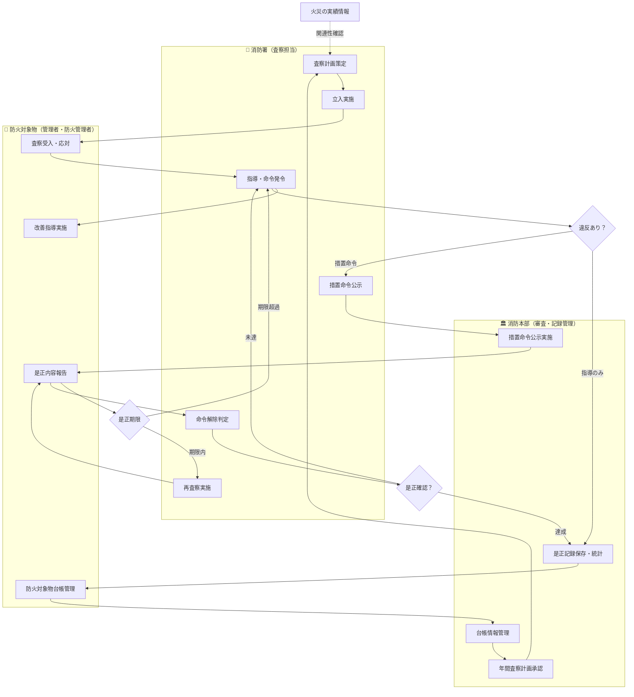

# 消防査察（防火対象物立入検査）

## 業務概要

市町村の消防署が、消防法に基づいて防火対象物（建築物）に対して実施する立入検査・査察業務。防火管理体制の確認、消防用設備等の点検状況確認、違反事項の指導・命令を通じて、火災予防と防火安全意識を向上させる。検査結果によっては措置命令を発令し、公示（公開）することで行政指導の透明性と実効性を担保する。

---

## 対象の類型

| 対象区分 | 具体例 | 特性 |
|---------|-------|------|
| **特定防火対象物** | 病院、診療所、老人ホーム、百貨店、ホテル、飲食店、映画館、劇場等 | 不特定多数または避難困難な利用者が多く、火災リスク高い |
| **非特定防火対象物** | 工場、倉庫、事務所、駐車場等 | 利用者が限定的、火災リスク相対的に低い |
| **立入制限場所** | 日中、夜間、定期的に無人となる施設 | 査察のタイミングと通知内容に配慮が必要 |
| **違反是正命令後の再査察** | 前回指摘事項の是正状況確認 | 命令内容の達成状況を確認し、命令解除判断へ |

---

## フロー図

---

## 詳細フロー：各ステップの説明

### 1. 防火対象物台帳管理 → 2. 年間査察計画策定

**実施者**: 消防署（査察担当） + 消防本部

**内容**:
- 消防本部が管理する防火対象物台帳をベースに、当該地域の特定防火対象物リストを抽出
- リスク評価（過去の違反履歴、火災実績、用途、収容人数等）に基づいて年間査察対象と優先順位を決定
- 査察計画を消防本部で承認・記録

**法的根拠**: 消防法第4条（立入検査権）

**補足**: 台帳に記載されていない新規テナント、用途変更物件の発見・追加登録も同時に実施

---

### 3. 立入実施（抜き打ちor事前通知）

**実施者**: 消防署査察担当（通常2名以上）

**パターン**:
- **抜き打ち検査**: 防火管理体制の日常的機能確認、隠蔽防止
- **事前通知**: 重要物件、協力が必要な物件への通知（通常24～72時間前）

**実施内容**:
- 防火管理者の選任状況確認（選任書、責任者配置）
- 消防用設備等（スプリンクラー、火災報知機、非常口等）の設置・点検状況確認
- 防火管理計画の整備確認
- 避難訓練実施記録の確認

**法的根拠**: 消防法第4条（立入検査権）

---

### 4. 各設備・書類確認 → 5. 指導事項・違反事項記録

**実施者**: 消防署査察担当

**内容**:
- チェックリスト形式で設備の有無・動作状況、書類の整備状況を確認
- 違反事項の写真撮影・記録
- 是正可能な不備（指導対象）と法令違反（命令対象）を分別

**記録方法**: 立入検査報告書、写真記録、指摘事項レポート

---

### 6. 改善指導

**実施者**: 消防署査察担当 ↔ 防火対象物（管理者・防火管理者）

**内容**:
- 指導レベルの事項について、是正方法・期限を口頭・文書で指示
- 軽微な設備不備、運用改善事項などがここに該当
- 管理者の確認署名・受領を取得

**特性**: 強制力を持たない行政指導（措置命令に格上げされることもある）

---

### 7. 決定分岐：違反あり？

**分岐条件**:
- **指導のみ**: 法令上の明確な違反ではなく、改善余地がある不備
- **措置命令へ**: 消防法違反が明確で、実害のリスクが高い事項

**例示**:
- 指導: 消防用設備の点検日が1ヶ月遅延している
- 命令: 必要な消防用設備が未設置のまま営業継続

---

### 8. 措置命令 → 9. 命令内容の公示

**実施者**: 消防署長（命令発令） → 消防本部（公示実施）

**内容**:
- 違反事項、是正期限（通常30日～3ヶ月）、是正内容を文書で通知
- 理由書、根拠法令を記載
- 命令内容を公示板に掲示、ホームページに公開（消防法第5条の3）

**法的根拠**: 消防法第5条（措置命令）、消防法第5条の3（命令の公示）

**公示の効果**: 法令遵守意識の向上、市民への透明性確保

---

### 10. 是正期限設定 → 11. 再査察・是正確認

**実施者**: 消防署査察担当

**内容**:
- 命令通知後、設定した是正期限終了後または終了日の数日前に再査察を実施
- 指摘事項の是正完了状況を確認（現地確認、書類確認）
- 再度チェックリストで確認し、是正達成度を記録

**期限超過時**: 未達成事項について管理者から理由説明を聴取し、期限延長or命令内容再指摘を検討

---

### 12. 命令解除 → 13. 台帳更新・記録保存

**実施者**: 消防署（命令解除判定） → 消防本部（台帳更新・統計）

**内容**:
- 是正確認が完了し、違反が除去されたと判定された場合、措置命令を解除
- 解除決定を文書で管理者に通知
- 防火対象物台帳に査察結果・命令解除を記録
- 年間実績に統計計上（市長報告、公表用途）

**記録保存**: 立入検査報告書、措置命令文書、再査察記録は5年間以上保存

---

## 補足説明

### 防火対象物台帳の役割
市町村の消防本部が法定台帳として管理。地名、用途、構造、所有者情報等を記載。査察計画、統計、防火行政の基礎となる。ただし、用途変更やテナント入替が台帳に反映されないと、実態と乖離が生じ、査察漏れが発生するリスクがある。

### リスクベース選定
過去の違反履歴、火災実績、利用者の避難困難性を考慮し、限られた査察資源を効率的に配分する手法。特定防火対象物（特に病院、老人ホーム、百貨店）は優先度を高く設定。

### 措置命令の公示
命令内容をホームページ等で公開することで、法令違反を犯した施設が特定される。これにより、当事者の法令遵守意識を高める、テナント入替時に建物履歴を把握させる、市民の施設安全情報選択に資する。

### 火災実績との関連確認
過去に火災が発生した物件については、当該火災の原因と現在の防火管理体制の関連を検討。同種の過失防止、予防的査察の判断に活用。

---

## 関連法令・通知

- 消防法第4条：立入検査権の規定
- 消防法第5条：措置命令の権限と実施方法
- 消防法第5条の3：措置命令の公示義務
- 総務省消防庁通知：「防火対象物の定期点検（自主点検）の推進について」
- 地域の消防条例・査察基準（市町村ごとに定める細則）

---

## 関連ワークフロー・業務

- **建築確認・開発許可**: 新築・改築時の消防同意、防火設備の設計段階関与
- **福祉施設（老人ホーム等）への立入**: 建築基準法、老健施設指定基準との重複確認
- **事故報告・火災原因調査**: 火災発生時の関連記録（査察歴、命令状況）の確認
- **苦情処理・市民相談**: 近隣施設の防火安全に関する苦情への対応、情報提供

