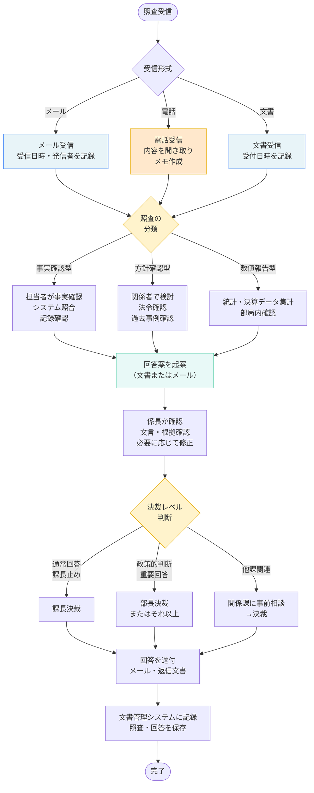
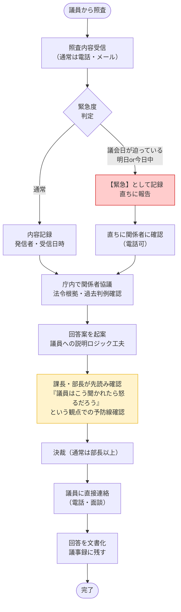

# 照査回答 典型業務フロー

## 照査回答とは

**定義**: 上位機関（県・市等の上位自治体）、議員、他課、住民からの「調べてほしい」「この件についてどうなっているか」といった照査に対して、担当課が調査・検討して回答を起案し、組織的な決裁を経て返答する業務。

**分類と例**:

| 照查タイプ | 具体例 | 性質 |
|---|---|---|
| **事実確認型** | 「◎◎の実績はいくつか」「この事件の発生状況は」 | 統計・記録の照合 |
| **方針確認型** | 「この場合の対応方針は」「見解は何か」 | 判断・解釈が必要 |
| **数値報告型** | 「◎◎事業の予算額・決算額は」「整備状況は」 | 数値・統計の集計 |
| **政治的照査** | 議員からの「これはどうなっているのか」 | 対外的責任が重い |

---

## 典型的な全体フロー



---

## 詳細フロー（議員照査の例）

議員からの照査は、対外的責任が重く、期限がシビア（議会前日が事実上の締切）な典型。



---

## よくある対応パターン

### パターン1：統計数値の報告

```
実績統計：「過去5年の○○事業の予算実績を教えてほしい」

→ 担当者：システムから抽出・集計
→ 係長：数値確認
→ 課長決裁（通常）
→ 回答送付
```

**期限**: 通常1〜3営業日

---

### パターン2：制度解釈の確認

```
方針確認：「障害者手帳の交付対象者の条件は」

→ 担当者：法令・要綱確認、関係部局に相談
→ 係長：解釈確認
→ 課長決裁（または部長協議後）
→ 回答送付

※ 単なる「制度説明」と「市としての見解」を区別して回答
```

**期限**: 通常3〜5営業日（相談相手による）

---

### パターン3：政治的照査への対応

```
政治照査：「この案件の市の対応方針は。なぜそうするのか」

→ 関係課で速やかに協議
→ 部長以上の判断
→ 回答文書を作成（「市としての見解」として明記）
→ 議員対応担当部門を通じて返答
→ 議会等での引用を想定して文言チェック
```

**期限**: 多くは議会日までに（事実上2〜7日程度）

---

## 庁内の照査回答関連部門

| 部門 | 関わり方 | タイミング |
|---|---|---|
| 総務部・法制部門 | 法令解釈が必要な照査の協力 | 相談時 |
| 関係課 | 横断的な照査への情報提供 | 報告受け後 |
| 広報・議会対応部門 | 議員・報道からの照査への事前相談 | 重要回答の決裁前 |
| 文書管理 | 照査・回答の記録・保存 | 完了後（即時） |
| 情報セキュリティ | 個人情報・秘密情報を含む回答の審査 | 決裁前 |

---

## 照査回答にかかる標準的な期限

| 照査の種類 | 目安 | 補足 |
|---|---|---|
| 統計数値報告 | 1〜3営業日 | システムから即座に抽出可能な場合 |
| 制度確認（単純） | 2〜3営業日 | 法令・要綱で明確な場合 |
| 制度解釈（複雑） | 3〜7営業日 | 他課協議・法制相談が必要な場合 |
| 議員照査 | 1〜7営業日 | 議会スケジュール次第（議会前日が事実上の締切） |
| 上位機関照査 | 指定期限に準ずる | 通常2週間程度 |

---

## 回答文書・メールの基本構造

**事務的な回答メール**:
```
【件名】照査回答：◎◎について

平素よりお疲れ様です。
先日照査をいただいた「◎◎について」、以下の通り回答いたします。

【ご照査の内容】
（質問を引用）

【回答】
（事実または見解）

根拠：（法令・要綱等）

ご不明な点がございましたら、お気軽にお問い合わせください。

〇〇課 ▲▲係
```

**重要な方針回答**:
```
【件名】照査回答：【市の見解】◎◎について

先日照査をいただいた「◎◎について」、市の見解を以下の通りお答えします。

【ご照査の内容】
（質問を明確に整理）

【市の見解】
（判断根拠を明示した答え）

根拠：
- 法令：●●法 第◎条
- 条例：◎◎市△△条例
- 過去の判例：★年 ××事件

【補足説明】
（必要に応じて背景情報）

【今後の対応】
（この回答に基づく実際の運用予定）
```

---

## 記録・管理の流れ

照査を受け付けた時点で：

1. **受付記録**: 「照査台帳」にて、日付・発信者・内容概要を記録（最小限の標準様式）
2. **起案・決裁**: 担当課で回答文書を起案・決裁（通常の決裁フロー）
3. **最終記録**: 回答完了後、文書管理システムにて照査・回答文書をセット保存

この3ステップで、「いつ、誰から、何を聞かれて、どう回答したか」が組織として把握可能になる。
