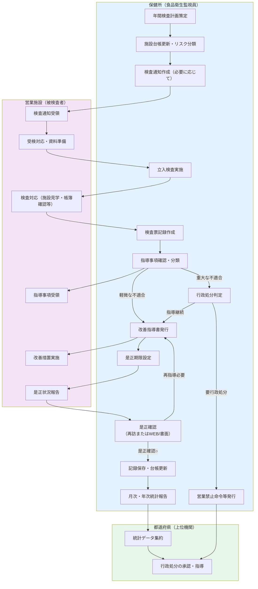

# 食品衛生監査・立入検査

## 業務概要

食品衛生法に基づき、市町村保健所は食品を扱う営業施設に対して定期的な立入検査を実施する。本フローは、年間計画に基づいた定期検査から是正確認、統計報告までの一連のプロセスを標準化したものである。検査結果に応じ、軽微な改善指導にとどまるケースから行政処分（営業禁止命令・許可取消等）に至るまで、多段階の対応が存在する。

## 対象業務の類型

| 検査の種類 | 対象施設 | 実施頻度 | 主な目的 |
|-----------|---------|---------|--------|
| 定期立入検査 | 許可営業施設全般 | 年1回～3回（施設種別・リスク分類で異なる） | 衛生状況の定期的監視・指導 |
| 許可更新検査 | 許可有効期限到来施設 | 更新時（通常3年毎） | 更新承認判断のための適格性確認 |
| 苦情・事故対応検査 | 食中毒疑い通報のあった施設等 | 発生時 | 原因究明・再発防止指導 |

## ワークフロー図

## 補足説明

### 1. 年間検査計画策定
- 前年度の検査実績、違反内容を分析
- 施設のリスク分類（高リスク、中リスク、低リスク）に基づき、検査対象施設と頻度を設定
- 法定受検数を確保する計画を作成

### 2. 施設台帳更新・リスク分類
- 許可申請・廃業報告に基づき、営業施設一覧を最新化
- 施設の業態（飲食店、製造業など）、過去違反履歴、事故歴からリスク分類を実施
- **注記**：台帳の陳腐化は現場課題（gap-notes参照）

### 3. 検査通知作成
- 事前通知は法律で義務ではないが、実務上は計画的検査の場合は通知することが多い
- 食中毒疑い対応等、緊急時は無予告検査を実施

### 4. 立入検査実施
- 営業施設に立入り、以下を確認：
  - 施設・設備の衛生状況
  - 帳簿類（仕入記録、加工記録等）の備置・記載状況
  - 従事者の衛生教育状況
  - 許可証の掲示状況
- 違反項目を検査票に記録

### 5. 検査票記録作成
- 検査当日の所見を詳細に記録
- 違反の種類（法違反、基準不適合、改善指導項目等）を区分
- 写真撮影等の証拠を保存

### 6. 指導事項確認・分類
**軽微不適合** → 改善指導書で対応
- 清掃不良、ラベル不明記等の軽微な衛生問題
- 是正期限：通常2週～1ヶ月

**重大な不適合** → 行政処分判定へ
- 許可要件を欠く営業
- 重篤な食中毒リスク行為
- 過去違反の繰り返し

### 7. 改善指導書発行
- 是正すべき事項を明記
- 是正期限（改善指導日から数週間～数ヶ月）を通知
- 施設で署名・捺印を取得し、指導記録を保存

### 8. 是正期限設定
- 施設の規模、改善難度、過去の対応実績を考慮
- 重大な違反は再検査予定日を明示
- 台帳に記録し、期限切れ監視対象とする

### 9. 是正確認
- **再訪検査（推奨）**：改善指導書に記載した期限経過後に再度訪問し、是正状況を確認
- **書面確認・WEB報告（簡略版）**：施設から改善内容の報告を受け、写真等で確認
- 是正不十分な場合は再度改善指導

### 10. 記録保存・台帳更新
- 検査記録は5年間保存（食品衛生法施行規則）
- 施設台帳に検査実施日、違反内容、是正状況を記載
- 是正完了をもって当該案件をクローズ

### 11. 統計報告
- 月次または年次で、都道府県に検査実績を報告
- 検査件数、違反件数、行政処分数等を集計
- 食品衛生監視計画の評価・改善に活用

### 12. 行政処分判定
**判定フロー（内部規程）：**
- **営業禁止命令**：食品衛生法第29条、食中毒発生時等の緊急対応
- **営業停止**：重大な違反が認められ、公衆衛生に危害の恐れがある場合
- **許可取消**：要件欠缺の常態化、悪質な違反の繰り返し

### 13. 営業禁止命令等発行
- 行政処分の決定後、対象施設に書面で通知
- 処分の理由、有効期限を明記
- 都道府県に報告・承認（許可取消の場合）
- 施設側は異議申立や審判請求の権利を行使可能

---

## 法的根拠

- **食品衛生法第28条**：保健所の立入検査権（施設への立入、帳簿確認、検体採取等）
- **食品衛生法第52条**：営業許可申請時の適格性確認、許可の要件
- **食品衛生法施行規則**：記録保存期間（5年）、衛生基準等の詳細
- **厚生労働省「食品衛生監視計画」**：年間検査の指針、優先度付けの方針

